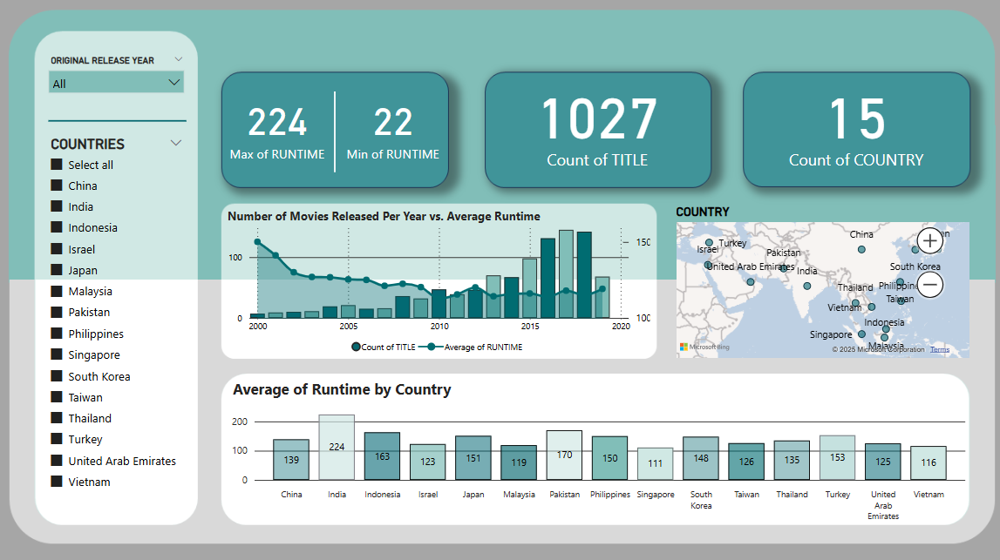

# 📊 Movie Dataset Analysis Dashboard (Power BI Project)

This **Power BI dashboard** is a project created to analyze and visualize insights from a **movie dataset**. The dataset was provided by our **university professor**, and we are required to present the data **formally in front of the class** as part of our **Experimental Statistics** subject.

## 📌 Dashboard Overview
This report provides insights into **movie runtime, release year distribution, and country-wise statistics**. The dashboard includes various visualizations to help understand trends and patterns in the dataset.

### 🔹 Key Insights:
- **Maximum Movie Runtime:** 224 minutes
- **Total Titles in Dataset:** 1027
- **Number of Countries Represented:** 15
- **Runtime Trends Over the Years:** A visualization comparing the number of movies released per year vs. their average runtime.
- **Country-Wise Analysis:** Average runtime of movies per country, displayed using a bar chart.
- **Geographical Distribution:** A dynamic map displaying the distribution of movies by country.

## 📌 Purpose of This Report
- This dashboard was developed as part of an **academic project** to enhance **data visualization and analytical skills using Power BI**.
- The insights generated are based on **educational sample data** and do not represent real-world industry statistics.

## 📌 Dashboard Preview  
  

## 📢 Data Source
This dataset was provided by our **university professor** for educational purposes in the **Experimental Statistics** subject.

---

🚀 _This project is part of a learning activity to develop Power BI expertise._
